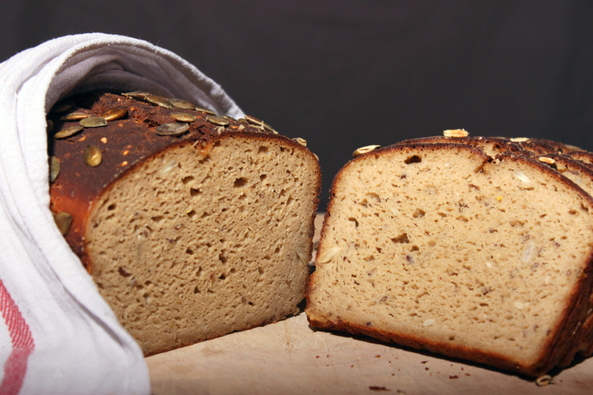
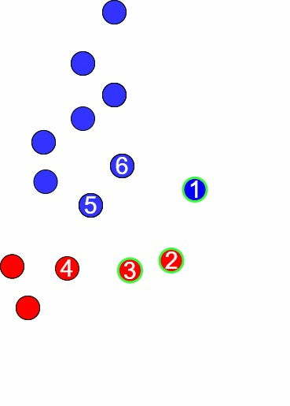

# Regularization Oversampling for Classification Tasks: To Exploit What You Do Not Know

<p align="center">

</p>


This repository contains the code of the paper <b>https://doi.org/10.1016/j.ins.2023.03.146</b> where we propose the Boundary
Regularizing Out-Of-Distribution (BROOD) sampler that adds artificial data points on the edge of the training data. By exploiting
these artificial samples, we are able to regularize the decision surface of discriminative machine learning models and make more
prudent predictions. Further, by smartly assigning predetermined non-uniform class probabilities outside the training data, we can
emphasize certain data regions and improve classifier performance on various material classification metrics.

To execute the experiments yourself, one can run the [datasets_benchmark.py](datasets_benchmark.py) to test the performance on the benchmark data sets. Although some imbalanced data sets are private, one can test the performance on the publicly available imbalanced data sets by running [datasets_imb.py](datasets_imb.py).

<p align="center">

</p>

## Data

The data of all benchmark and public imbalanced data sets that are used in the experiments can be found in the [data](data) folder. 

## Reference 

If you re-use this work, please cite:

```
@article{van2023regularization,
  title={Regularization oversampling for classification tasks: To exploit what you do not know},
  author={Van der Schraelen, Lennert and Stouthuysen, Kristof and Broucke, Seppe Vanden and Verdonck, Tim},
  journal={Information Sciences},
  year={2023},
  publisher={Elsevier}
}

Contact information: lennert.vanderschraelen@vlerick.com

All content in this repository is licensed under the MIT license.
